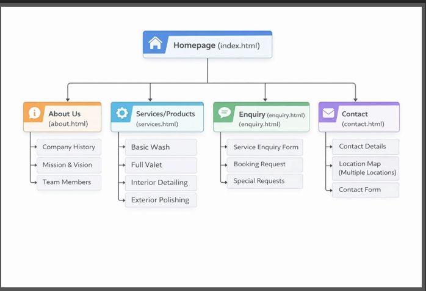
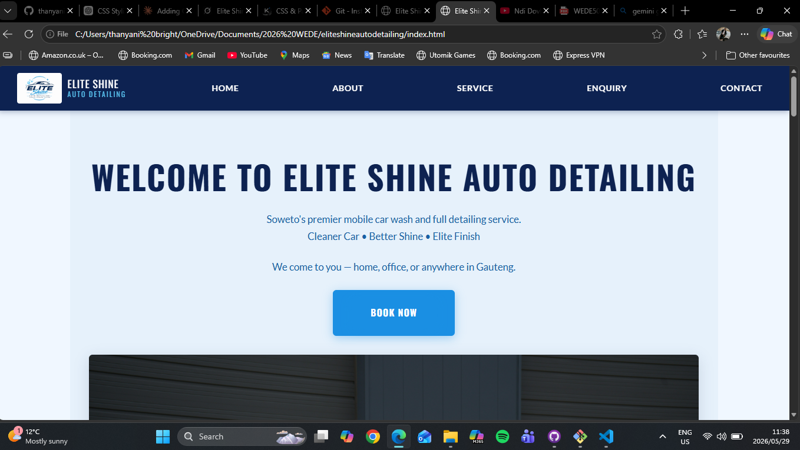
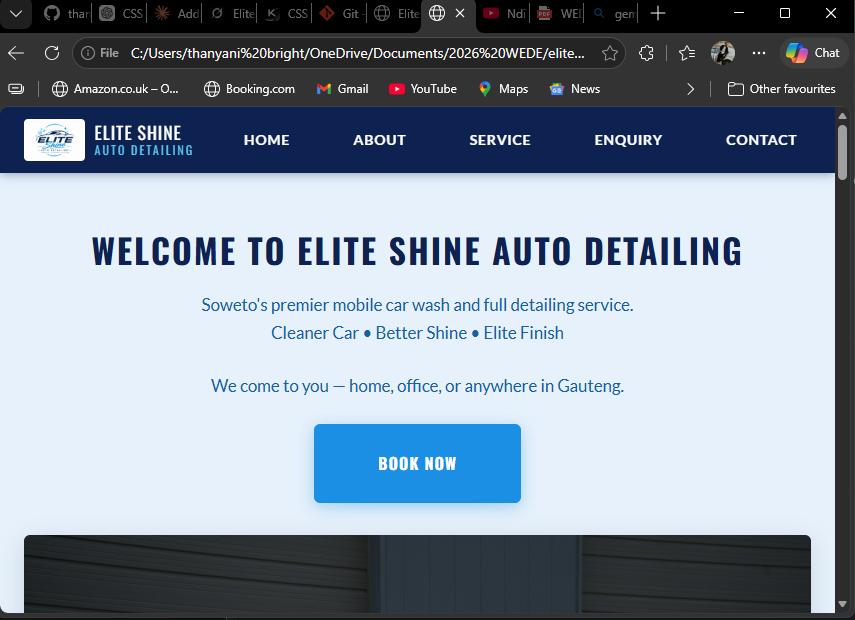
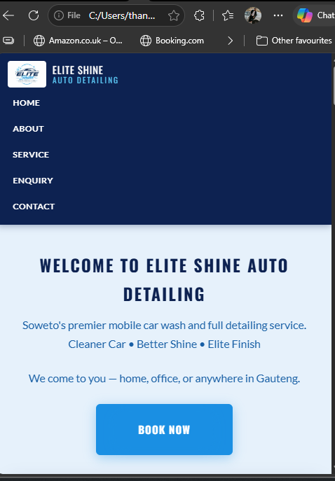

Elite Shine Auto Detailing Website Project POE

Subject: Web Development Introduction POE
Name: Mavhungu Thanyani Bright
Student Number: 10190374

1.Oraganisation Overview 
Name: Elite Shine Auto Detailing
Brief History: Elite Shine is  mobile car wash business that started in 2024 in Soweto Johannesburg, It started as a basic mobile car wash it is now known for also doing full  detailing valet.
Mission and Vision: is to grow the business and spread it’s winga , and have a office in JHB CBD.
Target Audience: people in Soweto and all Gauteng surrounding area.

2.Website Goals and Objectives
Goals for the website is to create a strong digital presence, attract customers, enable easy onlinr bookings, increase brand visibility,showcase pricing and service quality
Business would like to wash more cars per day and receive more booking (KPIs)

4. proposed website features and Functionality
Website Features: Homepage. About us, Service, Enquiry, Contact
Functionality: Online bookings, Feedback space

 5. Design and User Experience

Colour scheme: Deep Blue(#0A3D62), Light Blue(#3C91E6), White(#FFFFFF), Black(#1B1B1B)
Professional, clean, and modern bransing.
Typography: 
Heading- Montserrat, Bold, semi- bold. H1 and H2
Body text- Open Sans, regular light
Call to action- lato, Bold
H1- Main heading
H2- section headings
H3- subheadings
Body text- regular
Buttons- Bold and ALL CAPS

LAYOUT AND DESIGN
.MINIMALIST APPROACH
.GRID BASED LAYOUT
VISUAL HIERARCHY
HIGH QUALITY IMAGE
CONSISTENT BRANDING
INTERACTIVE ELEMENTS

HOMEPAGE LAYOUT
LOGO 
MENU(Home, about, services, enquiry, contact)
Cta BUTTON “BOOK NOW”
 Contact Section( phone number, whatsapp, email, location, contact from
FOOTER-quick link, social media, business name.

User experience Buttons are big and clickable, text is easy to read, Book now button is sticky

Technical Requirements
Hosting- 1-Grid.co.za
Domain- Eliteshineautodetailing.co.za

LANGUAGE 
. HTML, CSS, JAVASCRIPT

7. TIMELINE AND MILESTONE
                                         
Week 1–3 
Introduction to subject, understanding requirements, brainstorming ideas, Clear understanding of project scope 

Week 4     
Attended session on research methods and coding basics
Gained foundational skills           

Week 5     
Developed and refined project idea, conducted preliminary research  
Draft project idea ready             

 Week 6     
Attended final session before proposal, clarified expectations           
Ready to draft proposal              

Week 7     
Drafted project proposal (objectives, scope, methodology)               
Proposal draft completed      

Week 8     
Submitted proposal and waited for lecturer approval                      
Proposal approved                    

Week 9     
Completed and submitted Part 1                                           Part 1 submitted         

Week 10–11 
Continued development, applied feedback, improved project                
Part 2 near completion               

Week 12    
Finalized and submitted Part 2                                           Part 2 submitted                     

Week 13–14 
Final submission during assessment, presentation and evaluation         
Final assessment completed           

8. Budget
No budget will be need for this website,
Because for hosting free hosting material like 1-Grid will be used, and also development will be free because no images will be paid, free websites like pixabay will be used.
So only free material will be used for the website.

10.
SiteMap
 

 Bibliography
1-Grid, 2008. domain name search and registration. [Online] 
Available at: http://1grid.co.za
[Accessed 14 april 2026].
khumalo, N., 2023. how to edit a website. 4th ed. johannesburg: amazon KDP.
pixabay, 2026. stunning royalty free image and royalty free stock. [Online] 
Available at: http;//pixabay.cm
[Accessed 14 april 2026].
unsplash free images, 2026. photos. [Online] 
Available at: https://unsplashfreeimages.com
[Accessed 14 april 2026].
Leaflet, 2024. Leaflet — an open-source JavaScript library for
interactive maps. [Online] Available at: https://leafletjs.com/
[Accessed 19 June 2026].

OpenStreetMap contributors, 2024. OpenStreetMap. [Online]
Available at: https://www.openstreetmap.org/copyright
[Accessed 19 June 2026].

Mozilla Developer Network, 2026. Web APIs: IntersectionObserver.
[Online] Available at: https://developer.mozilla.org/en-US/docs/Web/API/Intersection_Observer_API
[Accessed 19 June 2026].

Google Fonts, 2026. Montserrat, Open Sans and Lato. [Online]
Available at: https://fonts.google.com/ [Accessed 19 June 2026].

how the website look on desktop
 

 how the website look on a tablet
 

 how website look on mobile phone
  
